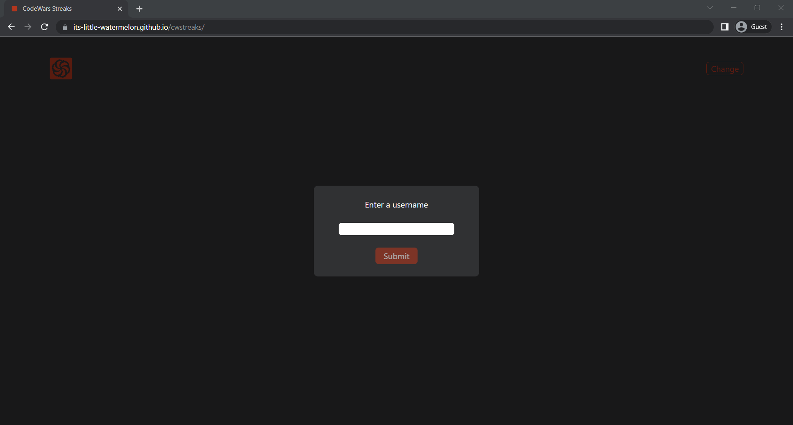
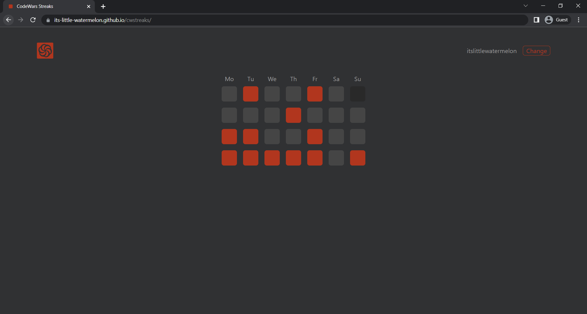
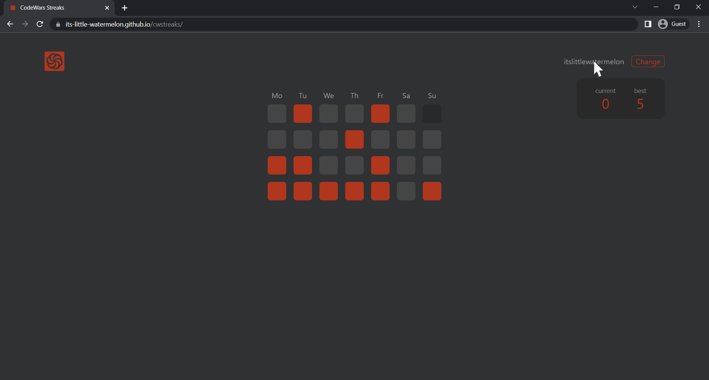

# CodeWars Streaks Tracker

A simple web app which uses the [CodeWars](https://www.codewars.com/) [API](https://dev.codewars.com/#users-api) to show the user their streak.

It was built using **React** (with **TypeScript**) and **Tailwind**.

## [DEMO](https://its-little-watermelon.github.io/cwstreaks/)

    

First, you enter your [CodeWars](https://www.codewars.com/) username. After all the data is fetched, you will see a table similar to this one:

    

The colored squares represent the days during which you solved at least one new challenge.

To see your current and best streak, hover over your username in the top right-hand corner.

    

## Limitations

- It might take a couple of seconds to fetch all the data (depending on the data size).
- It only counts unique challenges. If you solve a challenge you have already solved before (maybe in a different language), this challenge will not be counted.
